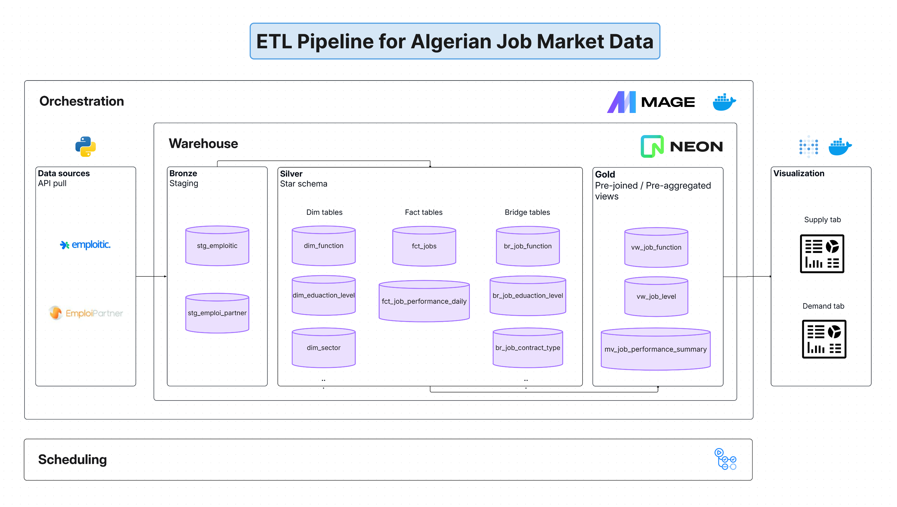
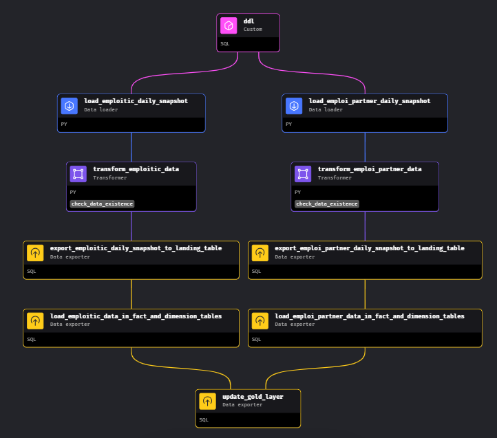
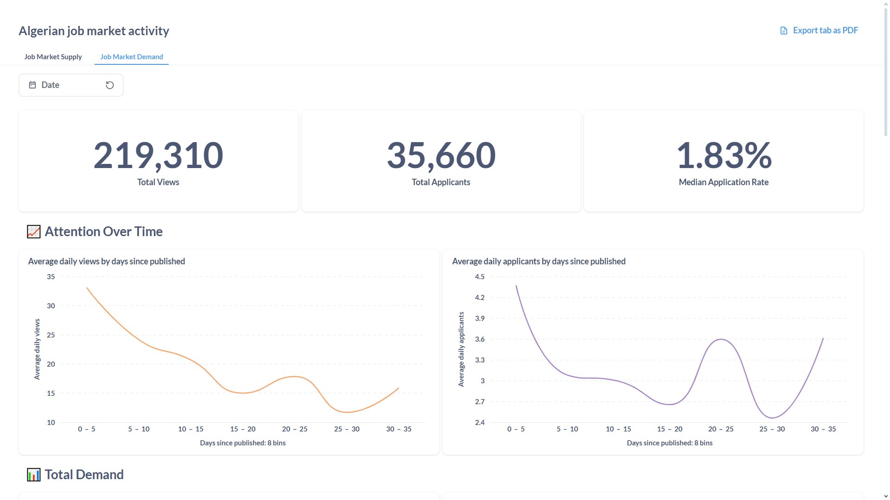

# 🇩🇿 Algerian Job Market Data Pipeline

This project is an ETL pipeline for exploring and analyzing the Algerian job market using data from leading job platforms. Whether you're a data enthusiast, researcher, or just curious, you're invited to try it out, explore, and contribute!

---

## ✨ Features
- Extracts job data from [Emploitic](https://emploitic.com) and [EmploiPartner](https://emploipartner.com) via APIs
- Transforms and loads data into a dimensional star schema (medallion architecture)
- Visualizes job market metrics and trends in Metabase dashboards
- Orchestrated with [Mage](https://mage.ai) and deployable via GitHub Actions
- Easy local setup with Docker

## 🛠️ Tech Stack
- Python, SQL
- Mage (orchestration)
- Docker
- PostgreSQL (hosted on [Neon](https://neon.com))
- Metabase (BI/dashboard)

## 🏗️ Architecture


The pipeline follows a medallion architecture with 3 layers:
- 🥉 **Bronze layer**: raw and staging data.
- 🥈 **Silver layer**: fact and dimension tables.
- 🥇 **Gold layer**: pre-joined bridge and dimension tables and pre-aggregated data as views.

## 🗺️ Pipeline DAG


## 📊 Dashboard
### 💼 Job Market Supply

👉 [See full dashboard](assets/algerian_job_market_supply_activity.pdf)
### 🧑‍💼 Job Market Demand

👉 [See full dashboard](assets/algerian_job_market_demand_activity.pdf)

## 👨‍💻 Setup
### 🖥️ Local setup
To reproduce locally, all you need is [🐳 Docker](https://docker.com).

1. **Clone this repo**

```bash
git clone https://github.com/nacer-benyoub/dz-jobs-data-pipeline.git
cd dz-jobs-data-pipeline
```

2. **Start the services**

```bash
docker compose up
```

3. Open [`http://localhost:6789`](http://localhost:6789) to access the Mage UI and either run the pipeline manually or create a new trigger.
4. Open [`http://localhost:3000`](http://localhost:3000) to access the Metabase UI. Then you can explore the data and create your charts and dashboards.

### ☁️ Remote setup
To deploy this pipeline using Neon and Github Actions, do the following:

1. Set up a [Neon](https://neon.com) instance (*or any managed Postgres database*) with a database for the warehouse, and another for storing Mage data (*optional*).
2. Fork this repo.
3. Create the necessary GitHub secrets using the database credentials from Neon:
   - **Warehouse DB:** The credentials need to be set as individual secrets as follows:
     - `POSTGRES_HOST`
     - `POSTGRES_USER`
     - `POSTGRES_DWH_DB`
     - `POSTGRES_PASSWORD`
   - **Mage DB:** the credentials for the Mage db need to be set as a connection URL (*can be pasted from Neon just like the individual credentials*) in a secret under the name `MAGE_DATABASE_CONNECTION_URL`
   - **Alerting (*optional*)**: To set up Telegram alerting in Mage when pipeline runs succeed or fail, follow this [guide](https://docs.mage.ai/observability/alerting/alerting-telegram) and set the `TELEGRAM_WEBHOOK_URL` GitHub secret using your created webhook URL.

## 🧩 Challenges
- Discovering the behavior of the unofficial, undocumented APIs via trial and error.
- Modeling many-to-many relationships using bridge tables.
- Standardizing columns coming from the two sources in different formats and languages.
- Handling a string encoding issue (`é` -> `u00e9`, `ï` -> `u00ef`) caused by Mage when loading `text[]` columns into Postgres, which taught me about the `unistr` function in Postgres. I have submitted an [issue](https://github.com/mage-ai/mage-ai/issues/5803) and a [PR](https://github.com/mage-ai/mage-ai/pull/5808) in the Mage GitHub repo for this.

## ⏩ Future work
- Add more data sources.
- Use Spark, Iceberg, and Minio to implement a lakehouse architecture and account for distributed compute and storage to scale properly.
- Use a more established orchestration tool like Airflow (or Astronomer).

## 🤝 Contributing
Contributions, suggestions, and questions are welcome! Feel free to open an issue or pull request. 💡